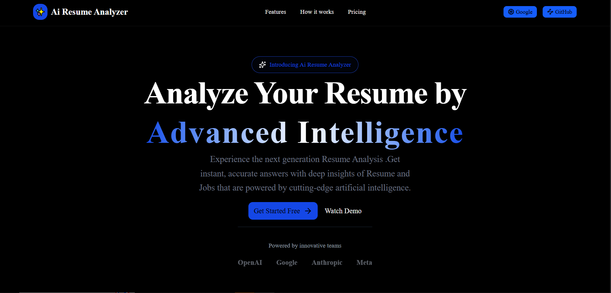
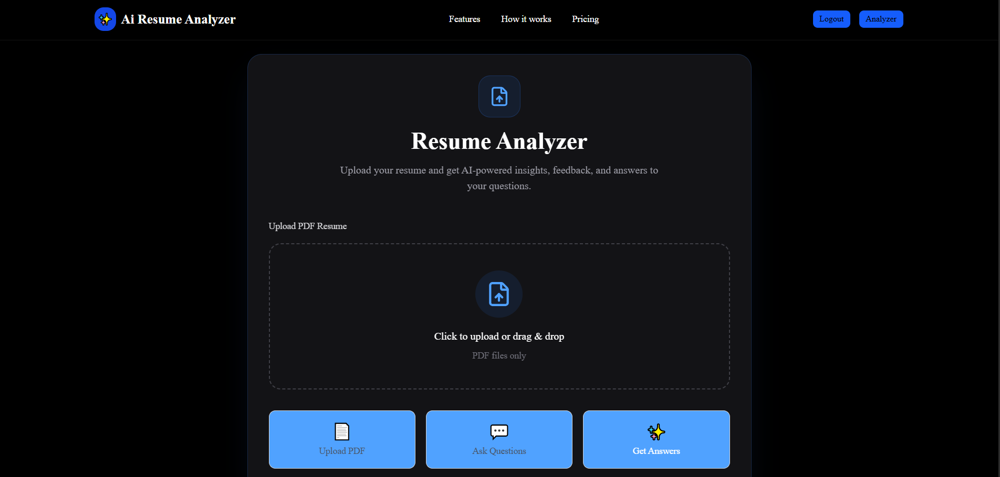
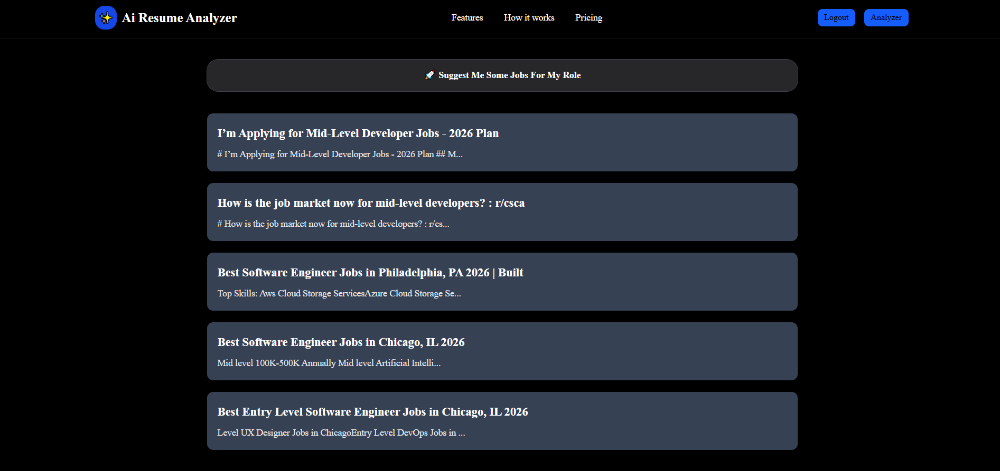

# AI Resume Analyzer

An AI-powered Resume Analyzer built with **Next.js**, **TypeScript**, **Gemini**, and **PDF processing** that helps job seekers evaluate their resumes, identify weaknesses, and improve their chances of passing Applicant Tracking Systems (ATS).

## 🚀 Features

* 📄 Upload PDF resumes
* 🔍 Extract text from PDF files
* 🤖 AI-powered resume analysis using Gemini
* 📊 ATS-style resume scoring
* ✅ Identify resume strengths
* ⚠️ Highlight weaknesses and missing information
* 💡 Generate actionable improvement suggestions
* 🎨 Modern and responsive UI
* 🔒 Type-safe development with TypeScript

---

## 🖼️ Screenshots

### Home Page



### Resume Analysis



---

### Job Results



---

## 🛠️ Tech Stack

### Frontend

* Next.js 15
* React
* TypeScript
* Tailwind CSS

### AI

* Gemini 2.5 Flash
* Google GenAI SDK

### PDF Processing

* pdfreader

### Future Enhancements

* Prisma ORM
* PostgreSQL
* Authentication
* Resume History
* Job Description Matching
* ATS Keyword Scanner

---

## 📂 Project Structure

```bash
src
├── app
│   ├── analyzer
│   └── api
│
├── actions
│   ├── analyzeResume.ts
│   └── pdfParser.ts
│
├── lib
│   ├── gemini.ts
│   └── pdf.ts
│
├── components
│   ├── upload
│   ├── analysis
│   └── ui
│
└── types
```

---

## ⚙️ Installation

Clone the repository:

```bash
git clone <your-repository-url>
cd ai-resume-analyzer
```

Install dependencies:

```bash
bun install
```

Create an environment file:

```bash
cp .env.example .env.local
```

Add your Gemini API key:

```env
GEMINI_API_KEY=your_api_key_here
```

Run the development server:

```bash
bun run dev
```

Open:

```txt
http://localhost:3000
```

---

## 🔄 How It Works

1. User uploads a PDF resume.
2. The application extracts text from the PDF using `pdfreader`.
3. The extracted content is sent to Gemini.
4. Gemini analyzes the resume and returns:

   * ATS Score
   * Strengths
   * Weaknesses
   * Suggestions
5. Results are displayed in a clean dashboard.

---

## 📈 Roadmap

### Phase 1

* [x] PDF Upload
* [x] PDF Text Extraction
* [x] Gemini Integration
* [x] Resume Analysis

### Phase 2

* [ ] Prisma Integration
* [ ] PostgreSQL Database
* [ ] Authentication
* [ ] Resume History

### Phase 3

* [ ] Job Description Matching
* [ ] ATS Keyword Analysis
* [ ] Resume Rewriting
* [ ] Cover Letter Generation

### Phase 4

* [ ] RAG-based Resume Search
* [ ] Multi-resume Management
* [ ] Advanced Analytics

---

## 🎯 Example Output

```json
{
  "score": 84,
  "strengths": [
    "Strong React experience",
    "Good project portfolio"
  ],
  "weaknesses": [
    "Missing quantified achievements",
    "No testing experience listed"
  ],
  "suggestions": [
    "Add measurable impact metrics",
    "Include testing frameworks and CI/CD tools"
  ]
}
```

---

## 📄 License

This project is open-source and available under the MIT License.
